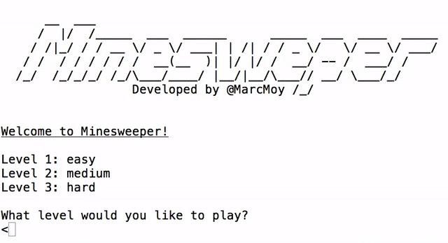

# Minesweeper

Created a ruby implementation of the game [Minesweeper][play-minesweeper] ([wiki][minesweeper-wiki]) to be played in the terminal.

`ruby lib/minesweeper.rb`

[play-minesweeper]: http://minesweeperonline.com/#beginner
[minesweeper-wiki]: http://en.wikipedia.org/wiki/Minesweeper_(Windows)

